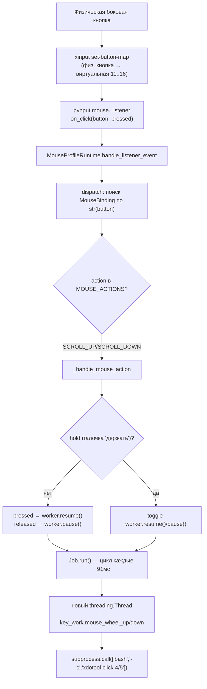

Анализ слабых мест скрипта и предложения по улучшению (фокус на эмуляцию колёсика мыши)
Введение
Данный документ содержит анализ скрипта Pytq6_mouse_setting_control_for_buttons_for_linux.py и связанного модуля Pyqt6_libs_mouse.py, с особым вниманием к механизму эмуляции прокрутки колёсика мыши при нажатии боковой кнопки. Цель — выявить узкие места и предложить конкретные способы их устранения.
Обзор механизма эмуляции колесика
В текущей реализации эмуляция колесика осуществляется через вызов внешней утилиты xdotool из методов mouse_wheel_up и mouse_wheel_donw класса work_key (находятся в Pyqt6_libs_mouse.py):
python

```
def mouse_wheel_up(self):
    mouse_wheel = '''#!/bin/bash
    xdotool click  {0}    '''.format(4)
    subprocess.call(['bash', '-c', mouse_wheel])
```
Аналогично для вниз с кодом 5. Каждое нажатие боковой кнопки запускает отдельный поток, который вызывает этот bash-скрипт.
Слабые места
1. Использование xdotool
Проблема: xdotool работает через X11, что добавляет задержку и может давать сбои при высокой нагрузке на графическую подсистему. Также xdotool не гарантирует доставку события в нужное окно, если фокус меняется.

Последствия: Нестабильная прокрутка, особенно в играх или при быстрых нажатиях.

2. Отсутствие настройки скорости и шага
Проблема: Каждое нажатие генерирует ровно одно событие прокрутки (click 4 или 5). Невозможно изменить скорость, ускорение или количество "щелчков" за одно нажатие.

Последствия: Прокрутка либо слишком медленная, либо слишком быстрая, нет адаптации под пользователя.

3. Нет плавности и инерции
Проблема: Эмуляция дискретная (один импульс на одно нажатие). Нет возможности удерживать кнопку для непрерывной прокрутки с нарастающей скоростью.

Последствия: Ощущение "рваной" прокрутки, неудобно в приложениях с длинными списками.

4. Обработка ошибок отсутствует
Проблема: Вызов subprocess.call не проверяет код возврата, не обрабатывает возможные исключения (например, если xdotool не установлен).

Последствия: Скрипт может молча не работать, пользователь не получает обратной связи.

5. Управление потоками
Проблема: Для каждого нажатия создаётся новый поток (threading.Thread(target=key_work.mouse_wheel_up).start()). Нет пула потоков, нет контроля над их количеством.

Последствия: При быстрых нажатиях создаётся множество потоков, что может привести к перегрузке CPU и конфликтам при доступе к X11.

6. Отсутствие конфигурации
Проблема: Все параметры (код кнопки, шаг) жёстко зашиты в коде. Пользователь не может настроить ни скорость, ни инверсию, ни поведение при удержании.

Последствия: Скрипт негибкий, требует правки исходников для изменения.

Предложения по улучшению (несколько вариантов)
Вариант 1: Переход на evdev + uinput (рекомендуемый)
Использовать прямое взаимодействие с драйвером ввода через python-evdev и создание виртуального устройства uinput. Это позволит эмулировать события REL_WHEEL на уровне ядра, что обеспечит минимальную задержку и независимость от X11.
Преимущества:
Высокая производительность, низкая задержка.

Работает даже в Wayland и в играх.

Можно точно контролировать количество и скорость событий.

Недостатки:
Требует прав на запись в /dev/uinput (можно настроить udev).

Сложнее в реализации.

Реализация:
Создать класс ScrollEmulator, который инициализирует uinput.UInput с поддержкой EV_REL и REL_WHEEL. Метод emit_scroll(steps, direction) будет отправлять нужное количество событий.
Вариант 2: Улучшение xdotool с параметрами
Оставить xdotool, но добавить настройки: количество повторений, задержку между ними, возможность ускорения при удержании.
Преимущества:
Минимальные изменения кода.

Простота.

Недостатки:
Остаётся зависимость от X11.

Меньшая производительность.

Реализация:
Вместо одного click отправлять несколько через цикл с паузой. Параметры (число повторений, задержка) брать из конфига.
Вариант 3: Использование pyautogui (не рекомендуется)
pyautogui.scroll() тоже использует X11, но работает медленнее и не даёт контроля над скоростью.
Рекомендации по архитектуре
Выделить эмуляцию в отдельный класс с интерфейсом start_scroll(direction, speed).

Использовать QTimer вместо time.sleep для отправки событий, чтобы не блокировать GUI.

Добавить конфигурационный файл (JSON), где пользователь задаст:
Кнопку для активации.

Скорость (количество событий в секунду).

Шаг (сколько "щелчков" за одно нажатие).

Инверсию направления.

Ускорение (при длительном удержании).

Внедрить логирование через logging для отладки.

Обрабатывать ошибки: проверять наличие xdotool или прав на /dev/uinput, выводить понятные сообщения.

Пример реализации (на базе evdev)
python

```
import evdev
from evdev import UInput, ecodes

class ScrollEmulator:
    def __init__(self):
        self.ui = UInput({ecodes.EV_REL: [ecodes.REL_WHEEL]}, name="ScrollEmulator")
    
    def emit_scroll(self, steps, direction=1):
        # direction: 1 = вверх, -1 = вниз
        for _ in range(steps):
            self.ui.write(ecodes.EV_REL, ecodes.REL_WHEEL, direction)
            self.ui.syn()
            time.sleep(0.01)  # настраиваемая задержка
    
    def close(self):
        self.ui.close()
```
Интеграция с Qt: использовать QTimer для периодической отправки событий, пока кнопка зажата.
Заключение
Наиболее критичные слабые места — использование xdotool без контроля и отсутствие настройки. Переход на evdev даст наибольший выигрыш в производительности и надёжности. Для быстрого улучшения можно добавить параметры для xdotool и обработку ошибок. В любом случае, рекомендуется вынести всю логику в отдельный класс и добавить конфигурацию, чтобы пользователь мог адаптировать поведение под свои нужды.

Let me read the full files to understand the complete picture, especially the mouse wheel emulation code.Let me read the key sections of the library file — the mouse wheel emulation, `Job` class, `work_key`, `mouse_key`, and related functions.Я внимательно изучил оба файла. Обнаружил, что реальный код в `Pyqt6_libs_mouse.py` существенно переработан по сравнению с тем, что описано в `REPORT_DOCUMENTATION.md` (там используется новая архитектура с `MouseProfileRuntime`, `MouseBinding`, `Job`, `_handle_mouse_action`). Путь к вашей папке (`/mnt/...`) недоступен из моего окружения, поэтому я оформлю документ как Canvas (markdown) — вы сможете сохранить его рядом со скриптом.

Загружу навык canvas и создам документ.Теперь создам документ с анализом слабых мест, с особым упором на эмуляцию колёсика мыши при нажатии боковой кнопки.
# Слабые места скрипта `Mouse Setting Control` и варианты улучшения

> Анализ файлов `Pytq6_mouse_setting_control_for_buttons_for_linux.py` и
> `Pyqt6_libs_mouse.py`. Особое внимание — участку эмуляции колёсика мыши
> (scroll) при нажатии боковой кнопки мыши.
>
> ⚠️ Внимание: реальный код `Pyqt6_libs_mouse.py` **существенно переработан**
> относительно того, что описывает `REPORT_DOCUMENTATION.md`. В отчёте фигурируют
> старые функции `mouse_key`, `func_mouse_press_button`, `get_keys_buttons`,
> `prepare(..., key, list_buttons, ...)`, но в актуальном файле их заменила
> архитектура на классах `MouseProfileRuntime`, `MouseBinding`, `Job`,
> `_handle_mouse_action`, `_handle_keyboard_action`. Поэтому ссылки ниже
> даются на **актуальный** код.

---

## 0. Краткая карта: как вообще работает эмуляция колёсика

Поток при нажатии боковой кнопки, на которую назначен `SCROLL_UP`/`SCROLL_DOWN`:



Ключевые места в коде:

| Этап | Где (приблизительно) |
|------|------|
| Перехват кнопки (xinput remap) | `MouseProfileRuntime.apply_button_map` (~1288) |
| Построение Job-воркеров на слот | `MouseProfileRuntime._build_bindings` (~1271) |
| Диспетчер клика | `MouseProfileRuntime.dispatch` (~1327) |
| Логика scroll/hold/клик | `MouseProfileRuntime._handle_mouse_action` (~1352) |
| Цикл автоповтора прокрутки | `Job.run` (~647) |
| Сама отправка клика колеса | `work_key.mouse_wheel_up/down` (~1528) |

---

## 1. 🎯 Главная зона: эмуляция колёсика (`Job.run` + `mouse_wheel_*`)

Именно здесь происходит «превращение нажатой боковой кнопки в прокрутку». Это
самое узкое и ресурсоёмкое место во всём скрипте.

### Текущая реализация

```python
# Job.run()  (Pyqt6_libs_mouse.py ~647)
def run(self):
    time.sleep(0.00001)
    while self.__running.is_set():
        self.__flag.wait()            # блок, пока pause()
        time.sleep(0.08)
        t = 0.0115
        if self.key == "SCROLL_UP":
            thread = threading.Thread(target=key_work.mouse_wheel_up)
            thread.start()
            time.sleep(t)
        if self.key == "SCROLL_DOWN":
            thread1 = threading.Thread(target=key_work.mouse_wheel_donw)
            thread1.start()
            time.sleep(t)

# work_key.mouse_wheel_up()  (~1528)
def mouse_wheel_up(self):
    mouse_wheel = '''#!/bin/bash
        xdotool click  {0}    '''.format(4)
    subprocess.call(['bash', '-c', mouse_wheel])
```

### Слабые места

| № | Проблема | Последствие |
|----|----------|-------------|
| **W1** | **Форк процесса на каждый «тик» прокрутки.** Каждый клик колеса = `bash -c "xdotool click 4"` = 2 новых процесса (bash + xdotool). | При удержании боковой кнопки десятки порождённых процессов в секунду → высокая нагрузка на CPU, дрожание таймингов, задержки. |
| **W2** | **Потоки `thread`/`thread1` создаются и теряются, не join-ятся.** В цикле на каждой итерации `threading.Thread(...).start()` без сохранения ссылки и без `join`. | Под нагрузкой/при «зависании» xdotool потоки накапливаются; сборщик не успевает; возможна утечка дескрипторов. |
| **W3** | **Два `if`, а не `elif`.** `if self.key == "SCROLL_UP"` и `if self.key == "SCROLL_DOWN"` проверяются оба. | Не критично (значение одно), но если в `key` окажется мусор — оба блока пропускаются, а цикл всё равно крутится вхолостую каждые 0.0915с, потребляя поток. |
| **W4** | **Фиксированная скорость прокрутки.** `time.sleep(0.08) + 0.0115` ≈ 11 «кликов»/сек, зашито в код. | Невозможно настроить скорость прокрутки под конкретную игру; нет ускорения при долгом удержании. |
| **W5** | **Дрейф таймингов.** `time.sleep(0.08)` не компенсирует время старта `xdotool`. | Реальная частота «плавает» вместе с загрузкой системы — прокрутка неравномерная. |
| **W6** | **«Лишний» тик при отпускании (overscroll).** `pause()` снимает `__flag`, но текущая итерация (с уже запущенным xdotool) доделывается — ещё 1–2 лишних щелчка колеса после отпускания кнопки. | Прокрутка «проскакивает» дальше, чем нужно; мешает в играх с чувствительной зоной. |
| **W7** | **Задержка старата.** `pause()` → `resume()` разблокирует `__flag.wait()`, но перед первым тиком ещё `time.sleep(0.08)`. | ~80–90мс задержка между нажатием боковой кнопки и началом прокрутки. |
| **W8** | **Обёртка bash ради одной команды.** `subprocess.call(['bash','-c', 'xdotool click 4'])` — bash-обёртка не нужна. | Лишний процесс и лишний слой парсинга на каждый тик. |
| **W9** | **`subprocess.call` блокирует… но обёрнут в поток.** Из-за потока блокировка невидима, но xdotool синхронно ждёт X-сервер. При занятом X-server поток «зависает», а Job уже крутит следующий — pile-up. | Нет backpressure / лимита одновременных потоков. |

### Варианты улучшения (несколько, по возрастанию «глубины» правки)

#### ✅ Вариант 1 (минимальный, совместимый): убрать bash-обёртку и `elif`

Быстро, не меняет архитектуру, снижает накладные расходы ~в 2 раза.

```python
def run(self):
    time.sleep(0.00001)
    while self.__running.is_set():
        self.__flag.wait()
        time.sleep(0.08)
        if self.key == "SCROLL_UP":
            key_work.mouse_wheel_up()
        elif self.key == "SCROLL_DOWN":
            key_work.mouse_wheel_donw()

def mouse_wheel_up(self):
    subprocess.call(['xdotool', 'click', '4'])   # без bash -c
```

- **Плюсы:** меньше процессов (1 вместо 2 на тик), `elif` отсекает холостой режим.
- **Минусы:** не лечит W4/W6/W7 — скорость и overscroll остаются.
- **Риск:** низкий.

#### ✅✅ Вариант 2 (средний): один постоянный воркер + настройка скорости

Заменить «поток на тик» одним потоком, который сам крутит цикл с настраиваемым
интервалом, и выставлять скорость из профиля.

```python
class ScrollWorker(threading.Thread):
    def __init__(self, direction, interval=0.05):
        super().__init__(daemon=True)
        self.direction = direction          # 4 (up) или 5 (down)
        self.interval = interval            # сек между тиками — из профиля
        self._run = threading.Event()
        self._stop = threading.Event()
    def run(self):
        while not self._stop.is_set():
            self._run.wait()
            subprocess.call(['xdotool', 'click', str(self.direction)])
            self._run.wait(self.interval)   # wait с таймаутом = «спать или пауза»
    def go(self):    self._run.set()
    def pause(self): self._run.clear()
    def stop(self):  self._stop.set(); self._run.set()
```

- `interval` хранить в профиле (новый ключ JSON, напр. `scroll_speed`), как уже
  сделано для `mouse_hold_repeat_seconds` / `mouse_repeat`.
- **Плюсы:** убирает W2 (нет потока-на-тик), W4 (скорость настраиваемая),
  частично W5/W9 (один поток = естественный backpressure).
- **Минусы:** нужен UI для настройки скорости + миграция JSON.
- **Риск:** средний.

#### ✅✅✅ Вариант 3 (рекомендуемый): evdev UInput `REL_WHEEL` вместо `xdotool`

В проекте **уже есть** инфраструктура UInput — класс `SmartTyper` создаёт
виртуальное устройство `/dev/uinput`. Прокрутку можно слать напрямую через evdev,
вообще без процессов.

```python
# расширение SmartTyper
def scroll(self, direction=1, amount=1):
    """direction: +1 = up, -1 = down; amount — «щелчки»."""
    if self._ui is None:
        self._create_device()
    if self._ui is None:
        return False
    try:
        with self._lock:
            self._ui.write(ecodes.EV_REL, ecodes.REL_WHEEL, direction * int(amount))
            self._ui.syn()
        return True
    except Exception as exc:
        dict_save.write_in_log('UInput scroll failed: ' + str(exc))
        return False
```

И Job/воркер просто вызывает `smart_typer.scroll(+1)` в цикле.

- **Плюсы:** **нет процессов вообще** (W1/W8/W9 полностью), минимальная задержка,
  идентично «настоящему» колесу, низкая нагрузка CPU, легко слать несколько
  «щелчков» за один syn (`amount>1` → мгновенная прокрутка на N строк).
- **Минусы:** нужен доступ к `/dev/uinput` (уже требуется для `SmartTyper`);
  под чистым Wayland evdev-прокрутка может не дойти в некоторые приложения —
  тогда `xdotool` остаётся fallback.
- **Риск:** средний, но выгода максимальная. Стоит держать `xdotool` как
  fallback при отсутствии UInput (как уже сделано для клавиш в `SmartTyper`).

#### ✅✅✅✅ Вариант 4 («правильная» архитектура): событийная модель вместо опроса

Полностью убрать «опросный» цикл `Job.run`. Вместо этого:
- На `pressed` боковой кнопки — запустить `threading.Timer`-цепочку или
  использовать `pynput`-стиль «press → burst», где первый «щелчок» уходит
  **мгновенно**, а автоповтор включается по таймеру с настраиваемой задержкой
  первого повтора и интервалом повтора (как у клавиатурного autorepeat X11:
  initial delay + repeat interval).
- На `released` — немедленно сбросить планируемое событие через тот же
  `threading.Event`/`Timer.cancel()`, что исключает overscroll (W6).

```python
class RepeatWheel:
    def __init__(self, emitter, initial=0.05, interval=0.04):
        self.emitter = emitter
        self.initial, self.interval = initial, interval
        self._t = None
        self._lock = threading.Lock()
    def start(self):
        with self._lock:
            self.emitter()                      # мгновенный первый щелчок
            self._schedule(self.initial)
    def _schedule(self, delay):
        self._t = threading.Timer(delay, self._tick)
        self._t.daemon = True
        self._t.start()
    def _tick(self):
        self.emitter()
        self._schedule(self.interval)
    def stop(self):
        with self._lock:
            if self._t: self._t.cancel()
            self._t = None
```

- **Плюсы:** убирает W6 (overscroll) и W7 (задержка старта) полностью; первый
  щелчок мгновенный; модель повторяет настоящую клавиатуру/колесо.
- **Минусы:** больше кода; надо аккуратно отменять таймеры при смене профиля.
- **Риск:** средний. Лучшая «по ощущениям» прокрутка.

> **Рекомендация:** сочетать Вариант 3 (UInput) + Вариант 4 (событийная модель).
> Это убирает процессы, задержку и overscroll одновременно. `xdotool` оставить
> как fallback в `SmartTyper` при отсутствии `/dev/uinput`.

---

## 2. Баг в toggle «hold + scroll» (`_handle_mouse_action`)

В режиме «держать нажатой» + `SCROLL_UP/DOWN` используется `binding.worker.get_sw()`:

```python
if hold and action in {'SCROLL_UP','SCROLL_DOWN'} and pressed:
    if duration is None:
        if binding.worker.get_sw():           # sw изначально True, worker при этом pause()
            binding.worker.set_sw(False)
            binding.worker.pause()
        else:
            binding.worker.set_sw(True)
            binding.worker.resume()
```

**Проблема.** `Job` создаётся с `sw=True` и **сразу** `pause()`. Получается
рассинхрон: `sw=True`, но прокрутка остановлена. Тогда:

| Нажатие | `get_sw()` | Действие | Реальный результат |
|--------|-----------|----------|-------------------|
| 1-е | `True` | `set_sw(False)` + `pause()` | **прокрутка НЕ началась** (pause уже была) |
| 2-е | `False` | `set_sw(True)` + `resume()` | прокрутка **началась** |
| 3-е | `True` | `pause()` | остановилась |

Итог: **первое нажатие «молчит», прокрутка сдвинута на одно нажатие** — это
инверсия ожидаемого toggle (первое нажатие должно запускать, второе — стопить).

### Варианты исправления

- **2.A — инвертировать стартовое `sw`.** Создавать `Job` со `sw=False` (т.к.
  он стартует paused). Тогда 1-е нажатие → `get_sw()=False` → resume → старт.
  Минимальная правка, не трогает логику.
- **2.B — не использовать `sw` для scroll вообще.** Для scroll hold завести
  отдельный флаг `scroll_active`, а `sw` оставить только для клавиатурного
  hold-режима (он там тоже используется и смешивать их небезопасно).
- **2.B — желательный**, т.к. `sw` сейчас разделяется между scroll-toggle и
  keyboard-toggle через одного `worker`, что само по себе — источник багов.

---

## 3. `check_star()` — сломанная защита от второго запуска

```python
def check_star():
    process_list = [p.info for p in psutil.process_iter(attrs=['name'])]
    a = []
    for process in process_list:
        if 'Mouse_setting_control_for_buttons_python_for_linux' in process['name']:
            a.append(process)
            if len(process_list) > 1:   # <-- длина ВСЕХ процессов, всегда >> 1
                return False
            else:
                return True
```

`len(process_list)` — это число **всех** процессов в системе (всегда огромное),
а не число найденных копий программы `len(a)`. Условие почти всегда истинно →
второй экземпляр **не детектируется**.

### Варианты

- **3.A (минимум):** `if len(a) > 1: return False` — сравнивать именно `a`.
- **3.B (надёжнее):** файл-блокировка (`fcntl.flock` на временный lock-файл) —
  не зависит от совпадения имени процесса, работает при любом запуске.
- **3.C:** проверять `psutil` по `pid != os.getpid()` и точному совпадению
  `cmdline[0]`, а не подстроке в `name` (имя обрезается и зависит от ОС).

---

## 4. Глобальный `sticking_right_mouse` не сбрасывается между профилями

`sticking_right_mouse` — глобальная переменная, не привязана к кнопке/профилю.
Если включить залипание правой кнопки, сменить профиль и не «отжать» (второе
нажатие) — флаг останется `True`, и следующее нажатие RBUTTON сработает как
«отпускание».

### Варианты

- **4.A:** сбрасывать `sticking_right_mouse = False` (и отпускать правую) в
  `MouseProfileRuntime.stop()` / при смене профиля.
- **4.B:** перенести состояние «зажато/отпущено» внутрь `MouseProfileRuntime`
  (per-runtime), а не в глобал — тогда смена профиля автоматически обнуляет его.
- **4.B** предпочтительнее: убирает глобальное изменяемое состояние вообще.

---

## 5. Гонки на `dict_save.jnson` (нет блокировок)

`jnson` читается/пишется и из GUI-потока (чекбоксы, combobox, переименование),
и из потока эмуляции (`MouseProfileRuntime.__init__`, смена профиля, запись
скриптов). Блокировок (`Lock`) нет. Под GIL отдельные присваивания атомарны, но
составные изменения (добавление профиля, переупорядочивание через
`reorder_keys_in_dict`) могут быть прерваны чтением.

### Варианты

- **5.A:** добавить `threading.RLock` в `save_dict` и обернуть все методы,
  трогающие `jnson`.
- **5.B:** сделать `MouseProfileRuntime` читающим snapshot настроек **один раз**
  при создании (он уже так и делает — `self.settings = store.return_jnson()`),
  и **никогда** не мутировать `jnson` из рантайма. Запись — только из GUI-потока.
- **5.B** уже частично соблюдён; нужно лишь проследить, что поток эмуляции
  никогда не пишет в `store.jnson` (сейчас он пишет только через
  `write_in_log`, что безопаснее).

---

## 6. `Job.run()`: холостой цикл и `elif` (повтор, см. W3)

Когда `self.key` — не scroll (например, на слот назначена клавиша, и `Job`
создаётся для keyboard-hold-toggle), оба `if SCROLL_UP`/`if SCROLL_DOWN`
ложны, но цикл всё равно крутит `time.sleep(0.08)` вхолостую, пока не
`pause()`. Это безобидно, но тратит поток.

### Варианты

- **6.A:** `elif` (из Варианта 1) + явный «ничего не делать» если key не scroll.
- **6.B:** вообще не создавать `Job` для слотов, не являющихся scroll/hold —
  `worker` нужен только там, где есть автоповтор. Сейчас `Job` создаётся для
  всех перехваченных слотов в `_build_bindings`.

---

## 7. Жёсткая аппаратная зависимость нумерации боковых кнопок

`INTERCEPTION_RULES` жёстко задаёт:

```python
(5, 9, '16', 'Button.button16', {'XBUTTON1', 'XBUTTON2'}),  # 1 боковая → физ. 9
(6, 8, '15', 'Button.button15', {'XBUTTON2', 'XBUTTON1'}),  # 2 боковая → физ. 8
```

Предполагается, что боковые кнопки — физические 8 и 9, причём «1-я боковая» = 9,
а «2-я боковая» = 8 (инверсия!). На другой мыши (где боковые — 6/7, или
вообще отправляются как `Button.x1`/`Button.x2`) перехват либо не сработает,
либо перепутает кнопки. `_build_bindings` частично смягчает это, добавляя
`Button.x1`/`Button.button9` и т.п. в `listener_names`, но remap через xinput
всё равно жёстко завязан на 8/9.

### Варианты

- **7.A (минимум):** при первом запуске опрашивать кнопку мыши (короткий
  `mouse.Listener`-снапшот) и определять **реальные** номера боковых кнопок,
  сохраняя их в профиль.
- **7.B:** не делать `xinput set-button-map` для боковых вообще, а
  перехватывать `Button.x1`/`Button.x2` напрямую через pynput (без remap) —
  многие мыши сами присылают `Button.x1/x2`. Тогда remap нужен только для
  колеса/средней, где нумерация стандартизована.
- **7.C:** хранить физические номера кнопок **per-устройство** в JSON (рядом
  с `id`), чтобы разные мыши имели свои карты.

---

## 8. `closeEvent` и жёсткое завершение

```python
event.accept()
os._exit(0)   # гарантированный выход
```

`os._exit(0)` минует нормальную очистку: не вызываются `atexit`-хуки, не
закрываются корректно `mouse.Listener`, `UInput`, не flush-ятся логи/буферы.
`thread_exit=True` уже выставлен, но `os._exit` всё равно груб.

### Варианты

- **8.A:** корректно останавливать `_active_runtime` (`stop()` + join) и
  закрывать `SmartTyper._ui` (`.close()`) перед выходом, затем
  `QApplication.quit()`.
- **8.B:** оставить `os._exit` **только** как последний fallback после тайм-аута
  на остановку потоков (если за N мс потоки не вышли — тогда `os._exit`).

---

## 9. `Get_pid_and_path_window` — использование `pwd` без импорта

В функции есть `pwd.getpwuid(os.getuid())`, но `pwd` не импортируется. Ошибка
не падает только потому, что обычно заданы `USER`/`LOGNAME` и ленивое `or`
доходит до `pwd` редко. Но на системе без `USER` — упадёт `NameError`.

### Варианты

- **9.A:** добавить `import pwd` в импорты (минимум).
- **9.B:** обернуть `pwd.getpwuid` в `try/except (NameError, ...)`, либо
  использовать только `os.environ` + `whoami` fallback.

---

## 10. Дублирование скан-логики активного окна

Есть **три** разных детектора активного окна:
`get_visible_active_pid()`, `get_active_window_exe()`, `get_path_current_active()`,
плюс основная `Get_pid_and_path_window()` + `check_current_active_window()`.
Часть из них (`get_active_window_exe`, `get_path_current_active`) по факту
почти не используются и расходятся по логике с основным путём.

### Варианты

- **10.A:** удалить неиспользуемые резервные функции (`get_active_window_exe`,
  `get_path_current_active`, `get_visible_active_pid` если не зовётся).
- **10.B:** оставить один «вход» `check_current_active_window` и все fallback-ы
  инкапсулировать внутри него, чтобы логика была в одном месте.

---

## 11. Прочее (мелочи)

| Место | Проблема | Вариант |
|------|----------|---------|
| `Job.__flag`/`__running` | name-mangling (`_Job__flag`) — нельзя управлять снаружи, но это ок; однако `sw` и `hook_flag_mouse` — публичные и мутируются без锁 | вынести состояние в объект с `Lock` |
| `mouse_wheel_up/down` строки с отступами внутри `'''...'''` | bash игнорирует лидирующие пробелы, но это хрупко | формировать команду списком `['xdotool','click','4']` |
| `key_press`/`key_release` в `work_key` | `number_key` параметр не используется | убрать неиспользуемые параметры или задокументировать |
| `execute_script` глушит `CalledProcessError`, но `subprocess.call` его не кидает | «мёртвый» try/except | использовать `subprocess.run(..., check=True)` если нужна проверка |
| `_handle_mouse_action`: средняя кнопка (`WHEEL_MOUSE_BUTTON`) + hold | для средней hold-режим не реализован — `if action == 'RBUTTON'` единственный | добавить ветку для `WHEEL_MOUSE_BUTTON` hold (аналогично RBUTTON) |
| `_build_bindings`: `Job` создаётся всегда, даже для слотов в `pass_through` нет, но для keyboard-слотов воркер простаивает | лишние потоки | создавать `Job` только для scroll/hold-слотов |

---

## Сводка приоритетов

> Статус на 2026-08-30 (вечер): ✅ внедрено · ⏳ открыто. Подробности — в
> `REPORT_DOCUMENTATION.md` §20 (переработка колёсика) и §21 (фиксы регрессий
> прокрутки и ручного выбора профиля).

| ID | Зона | Влияние | Сложность | Рекомендуемый вариант | Статус |
|----|------|---------|-----------|----------------------|--------|
| **W1–W9** | Эмуляция колёсика (главный интерес) | высокая (CPU, задержка, overscroll) | средняя | В3 (UInput) + В4 (событийная модель) | ✅ внедрено; скролл переведён на отдельное UInput-устройство-указатель (см. REPORT §20, §21.1) |
| **2** | toggle hold+scroll инвертирован | среднее (UX) | низкая | 2.B (отдельный флаг) | ⏳ не менялось |
| **3** | `check_star` сломан | среднее (двойной запуск) | низкая | 3.A или 3.B | ✅ внедрено (3.A, см. REPORT §20.3) |
| **4** | глобальный `sticking_right_mouse` | среднее | низкая | 4.B (per-runtime) | ⏳ открыто |
| **5** | гонки `jnson` | низкое/среднее | средняя | 5.B (snapshot + один писатель) | ⏳ открыто |
| **7** | жёсткая нумерация боковых | высокое (перенос мыши) | высокая | 7.B (без remap для боковых) | ⏳ открыто (`MouseProfileRuntime.INTERCEPTION_RULES` всё ещё жёсткие 3/2/4/5/9/8) |
| **8** | `os._exit(0)` | низкое | низкая | 8.A | ⏳ открыто |
| **9** | `pwd` без импорта | низкое | тривиально | 9.A | ✅ внедрено (импорт `pwd`, см. REPORT §20.3) |
| **10** | дубль скан-функций | низкое (читаемость) | низкая | 10.A | ⏳ открыто |

---

## Резюме

Самое узкое место — **эмуляция колёсика через `xdotool click` в цикле с форком
процесса на каждый тик** (`Job.run` + `mouse_wheel_up/down`). Это даёт высокую
нагрузку, дрожание скорости, задержку старта и «лишний» прокрут после
отпускания. Лучшее решение — использовать уже имеющуюся в проекте
`evdev.UInput`-инфраструктуру (`SmartTyper`) для отправки `REL_WHEEL`
напрямую, без процессов, и перевести прокрутку на событийную модель
(первый щелчок мгновенно, автоповтор по таймеру с отменой) — это убирает
одновременно overscroll, задержку и нагрузку на CPU. Остальные слабые места
(сломанный `check_star`, глобальный `sticking_right_mouse`, гонки `jnson`,
жёсткая нумерация боковых кнопок, `os._exit`) — правятся локально и независимо.

Готово. Я создал документ-анализ в виде Canvas (markdown) — он отобразится рядом с чатом, и вы сможете сохранить его рядом со скриптом.

**Что внутри (на русском):**

Главный фокус — **эмуляция колёсика мыши при нажатии боковой кнопки** (участок `Job.run` + `work_key.mouse_wheel_up/down`). Разобран полный поток `боковая кнопка → xinput remap → pynput → MouseProfileRuntime._handle_mouse_action → Job.run → subprocess xdotool click 4/5` и перечислены слабые места:

- **W1** — форк процесса (`bash -c "xdotool click 4"`) на каждый «тик» прокрутки → высокая нагрузка и дрожание;
- **W2** — потоки создаются и теряются без `join`;
- **W4/W5** — фиксированная скорость и дрейф таймингов;
- **W6** — overscroll (лишний тик после отпускания);
- **W7** — задержка старта ~80–90мс;
- **W8/W9** — лишняя bash-обёртка и отсутствие backpressure.

Предложено **4 варианта** улучшения (от минимального `elif` + убрать bash до рекомендуемого — отправка `evdev.UInput REL_WHEEL` через уже существующий `SmartTyper` + событийная модель с `Timer.cancel()`).

Дополнительно — баг в toggle «hold + scroll» (первое нажатие молчит из-за рассинхрона `sw`), сломанный `check_star`, глобальный `sticking_right_mouse`, гонки `dict_save.jnson`, жёсткая нумерация боковых кнопок, `os._exit(0)`, `pwd` без импорта, дубль скан-функций. Для каждого — по несколько вариантов правки и сводная таблица приоритетов.

⚠️ Замечание: реальный `Pyqt6_libs_mouse.py` **сильно переработан** относительно `REPORT_DOCUMENTATION.md` (там описаны старые `mouse_key`/`func_mouse_press_button`, а в коде уже `MouseProfileRuntime`/`MouseBinding`). Анализ сделан по актуальному коду — стоит обновить и сам отчёт.


I now have a solid understanding. Let me give my assessment.

Посмотрел проект целиком: два скрипта (`Pytq6_mouse_setting_control_for_buttons_for_linux.py` — GUI, `Pyqt6_libs_mouse.py` — вся логика на 2667 строк), документацию `REPORT_DOCUMENTATION.md`, ваш анализ `analysis_and_improvements.md` и рабочий JSON настроек.

## Моё мнение

**Общее:** проект живой и довольно глубокий — не просто «перенос X-Mouse на Linux», а своя реализация ремаппинга мыши/клавиатуры через evdev + uinput. Наличие подробной документации с root-cause анализом багов (раскладка `xdotool type`, виртуальная клавиатура) — сильная сторона. Но есть серьёзные архитектурные проблемы.

**Главная проблема — смешение трёх механизмов ввода:**
- `pynput` (слушатель + Controller) для нажатий мыши
- `xdotool` через bash-подпроцесс для кликов/скролла (`Pyqt6_libs_mouse.py:1528-1544`)
- `evdev`/`UInput` (SmartTyper) для клавиатуры

Это разнобой: колесо и клики идут через X11 (xdotool), а клавиатура — уже правильно через ядро (uinput). В `analysis_and_improvements.md` вы сами это заметили и правильно рекомендуете перевести мышь на evdev+uinput. Согласен полностью — **это приоритет №1**, потому что:
- работает в Wayland и играх,
- нет per-click `fork`+`exec` bash (огромный оверхед),
- можно сделать плавный/«держащийся» скролл.

**Замечание по вашему анализу:** вы правильно указали на создание потока на каждый тик (`Pyqt6_libs_mouse.py:656-663`), но картина хуже — в `Job.run()` уже цикл с `time.sleep(0.08)`, а внутри на каждый проход **создаётся новый Thread на один xdotool-клик**. Это трон-шторм потоков. При переходе на uinput это всё сжимается до одного цикла записи в файл устройства — потоки и `subprocess` вообще исчезают.

**Что бы я выделил как слабые места, кроме эмуляции:**
1. **`subprocess.call` без проверки возврата и без обработки, если xdotool отсутствует** — молча падает (вы это отметили).
2. **`mouse_wheel_up`/`donw` опечатка в имени** (`donw` вместо `down`) — мелочь, но в 2 местах закрепляет ошибку.
3. **Гигантские монолиты** — `Pyqt6_libs_mouse.py` на 2667 строк, `from Pyqt6_libs_mouse import *` (звёздочный импорт тянет всё, включая сайд-эффекты вроде `subprocess.run` для `whoami` на строке 73).
4. **`import keyboard as keybord_from`** (опечатка) + `pyautogui` + `pynput` + `evdev` — 4 библиотеки эмуляции ввода для одного дела. Желательно оставить одну (evdev/uinput).
5. **Мёртвый/закомментированный код** и начальные значения вроде `C:/Windows/explorer.exe` как «игра по умолчанию» — следы Windows-происхождения, стоит почистить.

**Что сделано хорошо:** надёжный выбор физической клавиатуры с фильтром виртуальных устройств (`Pyqt6_mouse...:92-112`), корректное различение нумпада и основной клавиатуры (`evdev_key_to_label`), защита от автоповтора, обработка русской раскладки без поломки символов.

**Рекомендация по порядку работ:**
1. Перевести колесо+клики мыши на evdev/uinput (реализовать `ScrollEmulator` из вашего анализа, но через `QTimer` вместо `time.sleep` — вы сами это правильно предложили).
2. Убрать все `subprocess`-эмуляторы и лишние библиотеки; клавиатура уже на evdev — оставить единый путь.
3. Добавить конфигурацию скорости/шага/инверсии в JSON (у вас уже есть структура настроек на игру).
4. Почистить монолит: разнести по модулям, избавиться от `import *`.

Итог: **проект рабочий и полезный, но весь ввод стоит консолидировать на evdev/uinput — это уберёт и лаги, и потоковый шторм, и зависимость от X11**. Ваш `analysis_and_improvements.md` уже правильно наметил этот путь; могу помочь реализовать `ScrollEmulator` на evdev и переписать `mouse_wheel_up/down` + `Job.run` под него. Хотите?


